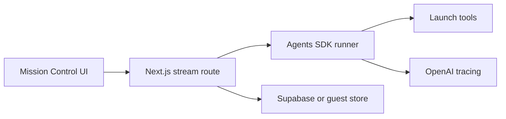

# Launch Desk

Launch Desk turns a rough product brief into an engineering release plan that a team can execute. The agent streams its work into a polished Mission Control UI and returns:

- a readiness score and prioritized plan;
- a concrete risk register;
- owner-specific checklists;
- channel-specific launch copy;
- material follow-up questions for missing evidence.

It uses the current OpenAI Agents SDK and Responses API patterns—not the deprecated Assistants API or legacy Chat Completions scaffolding. The default model is `gpt-5.6-terra`, with `OPENAI_MODEL` available as an override. See the [OpenAI model catalog](https://developers.openai.com/api/docs/models).

## Architecture



| Area | Location | Responsibility |
|---|---|---|
| Frontend | `components/`, `hooks/`, `app/page.tsx` | Intake, uploads, progressive activity, result tabs, refinement, cancellation |
| API | `app/api/` | Launch creation, signed uploads, NDJSON agent streaming |
| Agent | `lib/agent/` | Instructions, Agents SDK setup, SDK event normalization, safe errors |
| Tools | `lib/tools/` | Task extraction, readiness rubric, owner checklists, channel copy |
| Contracts | `lib/contracts/` | Zod schemas for requests, results, assets, and stream events |
| Persistence | `lib/server/`, `lib/storage/`, `lib/supabase/` | Guest adapters and authenticated Supabase repositories |
| Tests | `tests/` | Unit, component, integration, prompt-injection, and browser journeys |

The browser consumes newline-delimited JSON from `POST /api/agent/plan`. Sequence numbers are strictly increasing. Events include run lifecycle, tool progress, model text deltas, structured partials, follow-up questions, usage, completion, and safe terminal errors.

## Agent tools

- `extract_launch_tasks` converts rough requirements into normalized, prioritized work with owners, dependencies, acceptance criteria, and evidence sources.
- `check_launch_readiness` scores explicit evidence against a launch rubric and separates blockers, warnings, and missing details.
- `generate_owner_checklists` groups normalized tasks into actionable owner views.
- `draft_channel_copy` adapts grounded copy for release notes, email, in-app, social, internal, and support channels while flagging claims that need confirmation.

Add a new tool in `lib/tools/`, export it from `lib/tools/registry.ts`, describe its required use in `lib/agent/instructions.ts`, and cover the deterministic behavior in `tests/unit/tools/`.

## Local setup

Requirements: Node.js 22+, npm, and an OpenAI API key.

```bash
git clone https://github.com/imatthewtanner/launch-desk.git
cd launch-desk
npm install
cp .env.example .env.local
```

Set `OPENAI_API_KEY` in `.env.local`. Never prefix it with `NEXT_PUBLIC_` or commit it. For the fastest local path, keep guest mode enabled:

```dotenv
OPENAI_API_KEY=your_server_side_key
OPENAI_MODEL=gpt-5.6-terra
LAUNCH_DESK_GUEST_MODE=true
OPENAI_TRACING_DISABLED=false
```

Then start the app:

```bash
npm run dev -- --hostname 127.0.0.1
```

Open `http://127.0.0.1:3000`.

### Supabase workspace mode

Set `LAUNCH_DESK_GUEST_MODE=false`, create a Supabase project, and configure:

```dotenv
NEXT_PUBLIC_SUPABASE_URL=https://your-project.supabase.co
NEXT_PUBLIC_SUPABASE_PUBLISHABLE_KEY=your_publishable_key
SUPABASE_SECRET_KEY=your_server_secret_key
```

Apply the SQL files in `supabase/migrations/` in filename order. They create launches, assets, run history, row-level security, owner-scoped foreign keys, and private storage policies. Magic-link authentication redirects through `/auth/callback`.

Guest mode uses an in-memory launch repository plus a session-scoped local asset adapter. It is intended for local development and automated tests, not durable production data.

## Commands

```bash
npm test                 # unit, component, integration, and adversarial tests
npm run test:e2e         # desktop and mobile Chromium journey
npm run typecheck        # TypeScript without emit
npm run lint             # ESLint
npm run build            # production Next.js build
npm run build:vinext     # Cloudflare Workers build
npm run start:vinext     # preview the built Worker locally
npm run verify:live      # real streamed POST through the local API
```

`npm run verify:live` expects a running guest-mode server and reads `LAUNCH_DESK_BASE_URL` when the server is not at `http://127.0.0.1:3000`. It creates a launch, posts to the real agent route, reads the stream to completion, and fails unless it sees at least one `tool.progress`, one nonempty `text.delta`, and one `run.completed` event.

Example:

```bash
LAUNCH_DESK_BASE_URL=http://127.0.0.1:3000 npm run verify:live
```

The repository also includes `/api/test/agent-stream`, a deterministic non-production fixture used by the Playwright journey. In a production build it returns 404 unless `ENABLE_TEST_STREAM_FIXTURE=true` is explicitly set.

## Observability and safety

- OpenAI tracing is enabled by default and can be disabled with `OPENAI_TRACING_DISABLED=true`.
- Trace metadata includes run, launch, actor, model, and tool timing—but excludes prompts, asset contents, and secrets.
- Assets and all user-provided fields are wrapped as untrusted evidence. Agent instructions explicitly reject embedded role changes, secret requests, and completion claims without evidence.
- The API persists completed, partial, failed, and cancelled outcomes. Client cancellation preserves streamed partial text.
- Only supported MIME types are accepted, filenames are sanitized, files are capped at 20 MB, and authenticated storage paths are owner-scoped.

## Deployment

The production target is Cloudflare Workers through vinext. Authenticate Wrangler, then add the production values without committing them:

```bash
npx wrangler login
npx wrangler secret put OPENAI_API_KEY
npx wrangler secret put NEXT_PUBLIC_SUPABASE_URL
npx wrangler secret put NEXT_PUBLIC_SUPABASE_PUBLISHABLE_KEY
npx wrangler secret put SUPABASE_SECRET_KEY
npx wrangler secret put LAUNCH_DESK_GUEST_MODE # enter false
```

`OPENAI_MODEL` and `OPENAI_TRACING_DISABLED` are optional Worker secrets. Production guest mode is intentionally rejected; the Worker must use the durable Supabase workspace. `wrangler.jsonc` enables Node.js compatibility, Workers Cache for the vinext CDN adapter, static assets, and Worker observability.

Build and deploy:

```bash
npm run build:vinext
npm run deploy:vinext
```

Keep `.env.local` for local development only. For CI, inject the same values through the CI secret store before the Cloudflare build or deployment step.

Run the full validation gate before promotion:

```bash
npm test && npm run typecheck && npm run lint && npm run build && npm run build:vinext
```

Then deploy a preview, exercise the browser flow, inspect runtime errors, and promote the same validated artifact. See [docs/validation-checklist.md](docs/validation-checklist.md) for the release checklist.

## MCP App

The repository also contains a standalone, npm-based MCP App in [`mcp-app/`](mcp-app/). It reviews engineering launch readiness from plan, file, GitHub, and Linear evidence, then presents an approval-gated flow for creating recommended issues.

```bash
npm run mcp:typecheck
npm run mcp:test
npm run mcp:build
npm run mcp:dev
```

See [`mcp-app/README.md`](mcp-app/README.md) for provider credentials, optional OAuth and Supabase persistence, MCP connection details, approval guarantees, and the validation checklist.

## Codex plugin

The repo-local plugin in [`plugins/launch-desk/`](plugins/launch-desk/) packages the readiness-review skill, branded assets, and the local MCP connection. Install MCP dependencies and start the server first:

```bash
npm --prefix mcp-app install
./plugins/launch-desk/scripts/start-mcp.sh
```

The plugin connects to `http://127.0.0.1:3117/mcp`, avoiding the main app's default port. In another terminal, add this repository as a local marketplace and install the plugin:

```bash
codex plugin marketplace add "$PWD"
codex plugin add launch-desk@personal
```

Start a new Codex thread after installation so the skill and MCP tools are discovered. If the plugin is copied outside the repository, set `LAUNCH_DESK_REPO` to the absolute path of the Launch Desk clone before running its start script.

## License

MIT
